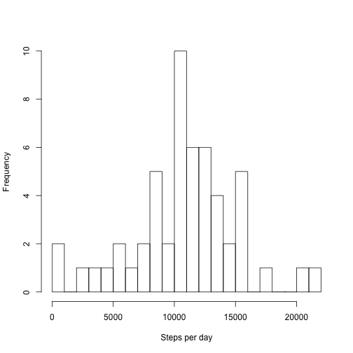
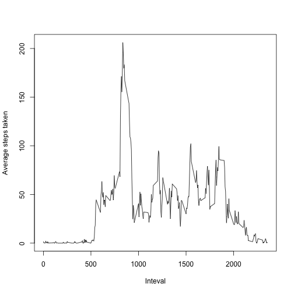
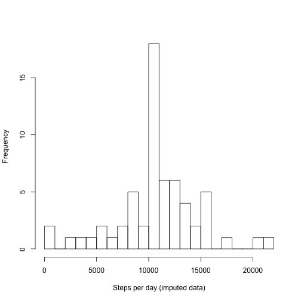

## Loading and preprocessing the data


```r
# load data
activity <- read.csv(unz("activity.zip", "activity.csv"), stringsAsFactors = FALSE)
# convert date
activity$date <- as.Date(activity$date)
```


## What is mean total number of steps taken per day?

First we need to aggregate number of steps by day


```r
activityByDay <- aggregate(steps ~ date, data = activity, FUN = sum, na.action = na.pass)
```

1. Make a histogram of the total number of steps taken each day


```r
hist(activityByDay$steps, breaks = 20, xlab = "Steps per day", main = NA)
```

 

2. Calculate and report the **mean** and **median** total number of steps taken per day

  a. **mean**


```r
mean(activityByDay$steps, na.rm = TRUE)
```

```
## [1] 10766.19
```

  b. **median**


```r
median(activityByDay$steps, na.rm = TRUE)
```

```
## [1] 10765
```


## What is the average daily activity pattern?

First we compute average daily activity


```r
averageDailyActivity <- aggregate(steps ~ interval, data = activity, FUN = mean, na.action = na.omit)
```

1. Make a time series plot (i.e. `type = "l"`) of the 5-minute interval (x-axis) and the average number of steps taken, averaged across all days (y-axis)


```r
plot(x = averageDailyActivity$interval, y = averageDailyActivity$steps, type = "l", xlab = "Inteval", ylab = "Average steps taken")
```

 

2. Which 5-minute interval, on average across all the days in the dataset, contains the maximum number of steps?


```r
averageDailyActivity$interval[which.max(averageDailyActivity$steps)]
```

```
## [1] 835
```


## Imputing missing values

1. Calculate and report the total number of missing values in the dataset (i.e. the total number of rows with `NA`s)


```r
summary(activity)
```

```
##      steps             date               interval     
##  Min.   :  0.00   Min.   :2012-10-01   Min.   :   0.0  
##  1st Qu.:  0.00   1st Qu.:2012-10-16   1st Qu.: 588.8  
##  Median :  0.00   Median :2012-10-31   Median :1177.5  
##  Mean   : 37.38   Mean   :2012-10-31   Mean   :1177.5  
##  3rd Qu.: 12.00   3rd Qu.:2012-11-15   3rd Qu.:1766.2  
##  Max.   :806.00   Max.   :2012-11-30   Max.   :2355.0  
##  NA's   :2304
```

Number of rows with missing values can be found under the summary of variable `steps`, which in this case is `2304`.

Alternatively we can compute number of rows with missing values as:


```r
sum(!complete.cases(activity))
```

```
## [1] 2304
```


2. Devise a strategy for filling in all of the missing values in the dataset. The strategy does not need to be sophisticated. For example, you could use the mean/median for that day, or the mean for that 5-minute interval, etc.

Here we will fill the missing values with the mean of that 5-minute interval (we already computed these values in the previous step and they are stored in `averageDailyActivity`). Steps to fill the missing values are:

   i. Create a copy of the data
   ii. For each row that has missing value:
      + Find the corresponding 5-minute interval row from `averageDailyActivity`
      + Impute the missing value with value of the corresponding row from `averageDailyActivity`

3. Create a new dataset that is equal to the original dataset but with the missing data filled in.


```r
# create a copy of the data
imputedActivity <- activity
for (r in which(is.na(imputedActivity$steps))) {
  # find the corresponding row from averageDailyActivity
  rr <- which(averageDailyActivity$interval == imputedActivity$interval[r])
  # imputes the missing value
  imputedActivity$steps[r] <- averageDailyActivity$steps[rr]
}
```

Double check to be sure that we don't have any missing value in the imputed dataset:


```r
sum(!complete.cases(imputedActivity))
```

```
## [1] 0
```

4. Make a histogram of the total number of steps taken each day and Calculate and report the **mean** and **median** total number of steps taken per day. Do these values differ from the estimates from the first part of the assignment? What is the impact of imputing missing data on the estimates of the total daily number of steps?

We first compute the total number of steps taken each day for the imputed dataset:


```r
imputedActivityByDay <- aggregate(steps ~ date, data = imputedActivity, FUN = sum)
```

Now we can plot the histogram of the total number of steps taken each day of the imputed dataset:


```r
hist(imputedActivityByDay$steps, breaks = 20, xlab = "Steps per day (imputed data)", main = NA)
```

 

The **mean** and **median** total number of steps taken per day of the imputed dataset:

a. **mean**


```r
mean(imputedActivityByDay$steps)
```

```
## [1] 10766.19
```

b. **median**


```r
median(imputedActivityByDay$steps)
```

```
## [1] 10766.19
```

The **mean** and **median** values here don't differ much from un-imputed dataset. The **median** tends to move to **mean** because we impute missing values by the average values of the corresponding 5-minute interval.

## Are there differences in activity patterns between weekdays and weekends?

First we create a helper function that convert date value to either "weekday" or "weekend" indicating whether a given date is a weekday or weekend day.


```r
weekday_type <- function(x) {
  dow <- weekdays(x)
  if ((dow == "Saturday") || (dow == "Sunday")) {
    return("weekend")
  }
  else {
    return("weekday")
  }
}
```

1. Create a new factor variable in the dataset with two levels -- "weekday" and "weekend" indicating whether a given date is a weekday or weekend day.


```r
imputedActivity$day_type <- as.factor(sapply(as.Date(imputedActivity$date), FUN = weekday_type))
```

2. Make a panel plot containing a time series plot (i.e. `type = "l"`) of the 5-minute interval (x-axis) and the average number of steps taken, averaged across all weekday days or weekend days (y-axis).


```r
# first we need to compute the average number of steps taken by weekday/weekend and by 5-minute interval
imputedAverageDailyActivity <- aggregate(steps ~ interval + day_type, data = imputedActivity, FUN = mean)
# now we can draw the plot
library(lattice)
xyplot(steps ~ interval | day_type, data = imputedAverageDailyActivity, type = "l", xlab = "Interval", ylab = "Number of steps", layout=c(1, 2))
```

 

